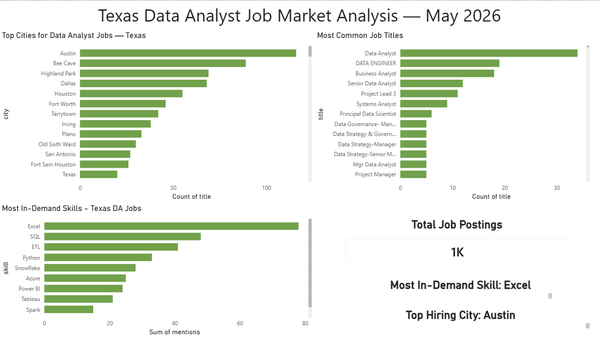

# Texas Data Analyst Job Market Pipeline

An automated data pipeline that pulls live Data Analyst job postings 
from the Adzuna API, stores them in MySQL, and visualizes hiring trends 
in Power BI — built to analyze the Texas DA job market in real time.

---

## Business Problem

What skills are Texas employers actually asking for in Data Analyst roles? 
Which cities have the most openings? This pipeline answers those questions 
using live data — not a downloaded CSV.

## Data Source

- **API:** Adzuna Jobs API (US)
- **Search:** "Data Analyst" jobs across Texas
- **Records pulled:** 1,153 live job postings
- **Date pulled:** May 2026

## Tools & Technologies

- **Python** (Pandas, Requests, Re) — API calls, data cleaning, 
  skill extraction
- **MySQL** — database design and storage
- **Power BI** — interactive dashboard

## How It Works

Adzuna API → Python (pull + clean + extract skills) → MySQL (store) → Power BI (visualize)

1. Python calls the Adzuna API across 24 pages of results
2. Cleans and transforms the raw JSON into a structured DataFrame
3. Extracts 19 skills from job descriptions using regex
4. Loads 1,153 rows into a MySQL database
5. Power BI connects to the data and visualizes key insights

## Key Findings

- **Excel is the most mentioned skill** — appears in 6.8% of postings, followed by SQL (4.2%) and ETL (3.6%)
- **Austin leads Texas with 135 DA job postings** — more than Dallas (73) and Houston (65) combined
- **Data Analyst is the most common title** (34 postings), followed by Data Engineer (22) and Business Analyst (19)
- **183 jobs were posted in the last 3 days** — showing an active, fast-moving hiring market
- **Snowflake (28) and Azure (25)** appear more than Power BI (24) and Tableau (21) — cloud skills are increasingly expected

## Dashboard Preview

## Project Structure

da-job-market-pipeline/
├── notebooks/
│   └── 01_api_pull_clean.ipynb    # API pull, cleaning, skill extraction
├── sql/
│   └── analysis_queries.sql       # 5 business queries in MySQL
├── data/
│   └── da_jobs_texas.csv          # Cleaned dataset (1,153 rows)
├── dashboard_screenshot.png       # Power BI dashboard preview
├── README.md
└── requirements.txt

## SQL Queries

5 business queries written in MySQL:
1. Skill mentions across all job postings
2. Top cities by job count and average salary
3. Skill percentage of total job postings
4. Most common job titles
5. Job postings by age (last 3 days vs older)

## How to Reproduce

1. Clone this repo
2. Sign up for a free Adzuna API key at https://developer.adzuna.com
3. Install dependencies: `pip install -r requirements.txt`
4. Add your API credentials to the notebook
5. Run `notebooks/01_api_pull_clean.ipynb`
6. Load `da_jobs_texas.csv` into MySQL using the schema in `sql/analysis_queries.sql`
7. Connect Power BI to MySQL or the CSV file

## What I Learned

- How to authenticate and paginate through a real REST API
- Using regex word boundaries to accurately extract skills from unstructured text
- The difference between predicted and real salary data — and why it matters for analysis
- Live data is messier than Kaggle datasets — vague job descriptions, missing locations, and duplicate postings are real challenges
- Excel and SQL dominate Texas DA job postings — validating my focus on these tools